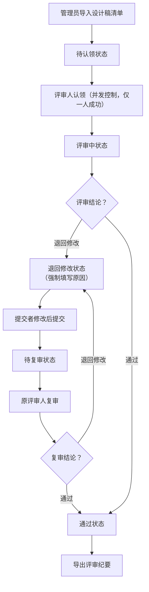

## 1. 产品概述

本地设计稿评审排队板是一个面向团队内部设计评审流程的管理工具，解决设计稿评审过程中状态混乱、权责不清、评论丢失的问题。目标用户包括设计提交者、专业评审人和流程管理员，通过可视化看板和状态流转实现评审流程的规范化管理。

产品核心价值在于：
- 清晰的状态流转，让评审进度一目了然
- 严格的权限控制，确保评审流程公正
- 完整的历史记录，便于追溯和审计
- 自动化纪要导出，减少人工整理成本

## 2. 核心功能

### 2.1 用户角色

| 角色 | 注册方式 | 核心权限 |
|------|----------|----------|
| 提交者 | 管理员创建 | 提交设计稿、查看自己提交的评审状态、查看评论、导出自己的评审纪要 |
| 评审人 | 管理员创建 | 认领待评审任务、进行评审（通过/退回）、添加评论、查看所有设计稿 |
| 管理员 | 系统预设 | 用户管理、导入设计稿清单、查看所有评审、强制变更状态、导出全部评审纪要 |

### 2.2 功能模块

1. **登录页**：角色选择登录、身份验证
2. **看板主页**：五列状态看板（待认领、评审中、退回修改、待复审、通过）、拖拽或按钮操作流转
3. **设计稿详情**：基本信息展示、评论历史时间线、状态流转操作、退回原因记录
4. **导入功能**：CSV格式清单导入、重复design_id冲突检测、导入预览
5. **用户管理（管理员）**：用户增删改、角色分配
6. **纪要导出**：按筛选条件导出评审纪要、包含完整历史记录

### 2.3 页面详情

| 页面名称 | 模块名称 | 功能描述 |
|----------|----------|----------|
| 登录页 | 身份选择 | 用户名密码登录、角色自动识别、登录状态保持 |
| 看板主页 | 头部导航 | 当前用户信息、角色切换（如有权限）、导入按钮、导出按钮、用户管理入口 |
| 看板主页 | 五列看板 | 每列显示对应状态的设计稿卡片，显示design_id、名称、提交者、认领人、优先级 |
| 看板主页 | 设计稿卡片 | 悬停显示详情预览、点击打开详情、快捷操作按钮（认领/提交评审/通过/退回） |
| 设计稿详情 | 基本信息 | design_id、设计名称、提交者、当前状态、当前认领人、创建时间、优先级 |
| 设计稿详情 | 状态流转 | 根据当前状态和用户角色显示可用操作按钮 |
| 设计稿详情 | 评论区 | 评论列表时间线、新增评论输入框、支持@提及和附件标记 |
| 设计稿详情 | 退回原因 | 退回操作时强制填写原因、历史退回原因可追溯 |
| 导入弹窗 | 文件选择 | 支持CSV文件拖拽或选择、样例模板下载 |
| 导入弹窗 | 冲突检测 | 导入前预检查、重复design_id高亮提示、冲突项不可覆盖 |
| 导入弹窗 | 导入预览 | 显示待导入数据清单、可勾选确认后导入 |
| 用户管理 | 用户列表 | 显示所有用户及其角色、支持新增编辑删除 |
| 导出功能 | 筛选条件 | 按状态、时间范围、提交者、评审人筛选 |
| 导出功能 | 预览与下载 | 导出内容预览、支持Markdown格式下载 |

## 3. 核心流程

### 3.1 评审主流程

### 3.2 并发认领流程

1. 设计稿处于"待认领"状态
2. 评审人A点击认领，系统加锁
3. 评审人B同时点击认领，系统检测锁状态
4. 评审人A认领成功，状态变为"评审中"，认领人为A
5. 评审人B收到"已被他人认领"提示
6. 操作日志记录认领时间和结果

### 3.3 权限控制流程

- 提交者不能操作自己提交的设计稿进入"通过"状态
- 只有被认领的设计稿才能进行评审操作
- 退回操作必须填写原因
- 重复导入的design_id不能覆盖已有评论历史

## 4. 用户界面设计

### 4.1 设计风格

采用**工业级极简主义**设计风格，强调功能性和可读性：

- **主色调**：深海军蓝 `#1e3a5f`，代表专业和严谨
- **辅助色**：琥珀橙 `#f59e0b`（待认领）、天蓝 `#0ea5e9`（评审中）、珊瑚红 `#ef4444`（退回）、墨绿 `#10b981`（通过）、紫罗兰 `#8b5cf6`（待复审）
- **中性色**：锌灰系列 `#fafafa / #f4f4f5 / #d4d4d8 / #71717a / #27272a`
- **按钮风格**：直角矩形、2px边框、实心/空心两种样式，hover时背景色加深
- **字体**：标题使用 JetBrains Mono（等宽字体，强化工业感），正文使用 Inter（清晰易读）
- **布局风格**：五列等宽网格布局，卡片采用细线边框+微妙阴影，状态列头部使用对应辅助色做垂直色条标识
- **图标**：lucide-react 线性图标，统一16px/20px尺寸

### 4.2 页面设计概述

| 页面名称 | 模块名称 | UI元素 |
|----------|----------|--------|
| 登录页 | 登录卡片 | 居中悬浮卡片、工业风金属质感边框、Logo+标题、表单输入、提交按钮、错误提示动画 |
| 看板主页 | 头部 | 深色导航栏、左侧产品名称、右侧用户信息+操作按钮组、1px底部分隔线 |
| 看板主页 | 五列看板 | 每列顶部垂直色条+状态名称+计数徽章、卡片间距8px、内部滚动、列最小宽度280px |
| 看板主页 | 设计稿卡片 | 顶部design_id标签、中部设计名称、底部提交者/认领人信息、右侧优先级角标、hover时上移2px+阴影加深 |
| 设计稿详情 | 侧边抽屉 | 从右侧滑入、宽度480px、半透明遮罩、顶部标题栏、中部滚动内容区、底部操作按钮组 |
| 设计稿详情 | 时间线 | 左侧垂直线条、节点圆形标记、时间+操作人+内容三段布局、退回评论红框突出 |
| 导入弹窗 | 模态框 | 居中显示、三步进度条（选择文件→检测冲突→确认导入）、表格预览、冲突行红底高亮 |
| 导出功能 | 导出面板 | 筛选条件折叠区、预览区域代码块样式、复制/下载按钮 |

### 4.3 响应式

- **桌面端优先**：针对1920×1080及以上分辨率优化
- **平板适配**：看板列可横向滚动，卡片尺寸保持不变
- **不支持移动端**：本产品为桌面端工具，不做移动端适配

### 4.4 微交互设计

- 页面加载：头部导航渐入→各列看板依次延迟100ms滑入→卡片交错淡入
- 卡片拖拽：拖拽时半透明+12px圆角，目标列高亮边框
- 状态变更：卡片从原列淡出→新列淡入+缩放回弹
- 评论提交：输入框收起→新评论从底部滑入+高亮闪烁
- 认领冲突：弹出Toast提示，按钮抖动动画
