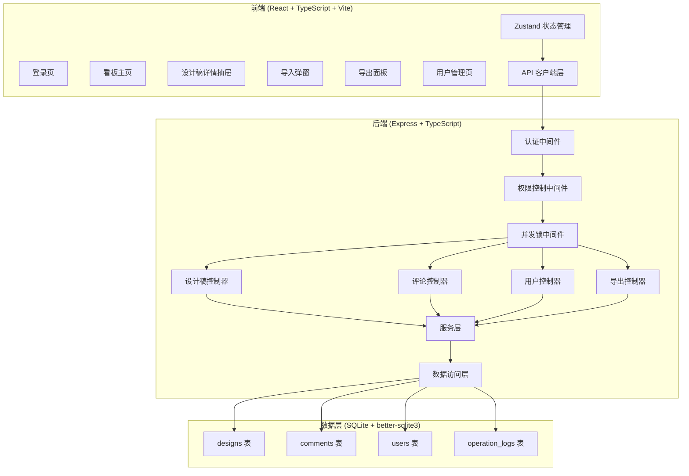
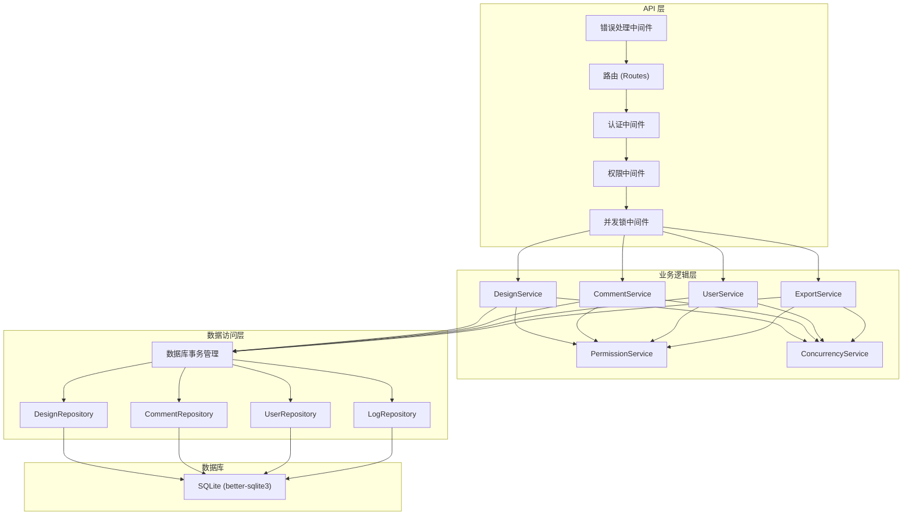
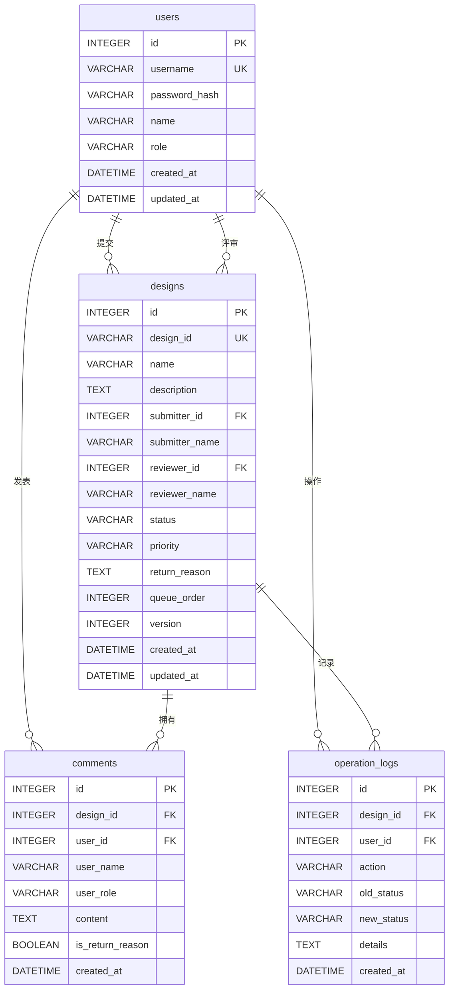

## 1. 架构设计



## 2. 技术描述

- **前端**：React@18 + TypeScript + Vite@5 + tailwindcss@3 + zustand@4 + react-router-dom@6 + lucide-react
- **后端**：Express@4 + TypeScript + better-sqlite3（同步SQLite驱动，支持事务和锁）
- **数据库**：SQLite 本地文件存储，无需额外服务，数据持久化在 `./data/review-board.db`
- **认证**：Session-based 认证，Express Session + SQLite 存储
- **并发控制**：数据库行级锁 + 应用层乐观锁（version字段）
- **初始化工具**：vite-init react-express-ts 模板

## 3. 路由定义

### 前端路由

| 路由 | 页面组件 | 访问权限 |
|------|----------|----------|
| /login | Login | 公开 |
| /board | Board | 所有登录用户 |
| /users | UserManagement | 仅管理员 |

### API 路由

| 方法 | 路径 | 控制器 | 权限 | 说明 |
|------|------|--------|------|------|
| POST | /api/auth/login | auth | 公开 | 用户登录 |
| POST | /api/auth/logout | auth | 登录 | 用户登出 |
| GET | /api/auth/me | auth | 登录 | 获取当前用户 |
| GET | /api/designs | design | 登录 | 获取设计稿列表 |
| GET | /api/designs/:id | design | 登录 | 获取设计稿详情 |
| POST | /api/designs/import | design | 管理员 | 导入设计稿清单 |
| POST | /api/designs/:id/claim | design | 评审人/管理员 | 认领设计稿 |
| POST | /api/designs/:id/review | design | 评审人/管理员 | 提交评审结论 |
| POST | /api/designs/:id/resubmit | design | 提交者/管理员 | 提交修改后待复审 |
| GET | /api/designs/export | export | 登录 | 导出评审纪要 |
| GET | /api/designs/:id/comments | comment | 登录 | 获取评论列表 |
| POST | /api/designs/:id/comments | comment | 登录 | 添加评论 |
| GET | /api/users | user | 管理员 | 获取用户列表 |
| POST | /api/users | user | 管理员 | 创建用户 |
| PUT | /api/users/:id | user | 管理员 | 更新用户 |
| DELETE | /api/users/:id | user | 管理员 | 删除用户 |

## 4. API 定义

### TypeScript 类型定义

```typescript
// shared/types.ts

export type UserRole = 'submitter' | 'reviewer' | 'admin';

export type DesignStatus = 
  | 'pending_claim'    // 待认领
  | 'reviewing'        // 评审中
  | 'returned'         // 退回修改
  | 'pending_review'   // 待复审
  | 'passed';          // 通过

export interface User {
  id: number;
  username: string;
  name: string;
  role: UserRole;
  createdAt: string;
}

export interface Design {
  id: number;
  designId: string;        // 业务ID，唯一
  name: string;
  description: string;
  submitterId: number;
  submitterName: string;
  reviewerId: number | null;
  reviewerName: string | null;
  status: DesignStatus;
  priority: 'high' | 'medium' | 'low';
  returnReason: string | null;
  queueOrder: number;      // 队列顺序，导入时保留
  version: number;         // 乐观锁版本号
  createdAt: string;
  updatedAt: string;
}

export interface Comment {
  id: number;
  designId: number;
  userId: number;
  userName: string;
  userRole: UserRole;
  content: string;
  isReturnReason: boolean; // 是否为退回原因
  createdAt: string;
}

export interface OperationLog {
  id: number;
  designId: number;
  userId: number;
  action: string;
  oldStatus: DesignStatus | null;
  newStatus: DesignStatus | null;
  details: string | null;
  createdAt: string;
}

// 请求类型
export interface LoginRequest {
  username: string;
  password: string;
}

export interface ImportDesignItem {
  designId: string;
  name: string;
  description: string;
  submitter: string;
  priority?: 'high' | 'medium' | 'low';
}

export interface ReviewRequest {
  action: 'pass' | 'return';
  reason?: string;
  comment?: string;
}

export interface ExportFilter {
  status?: DesignStatus;
  submitterId?: number;
  reviewerId?: number;
  startDate?: string;
  endDate?: string;
}
```

### 关键API响应示例

**POST /api/designs/:id/claim 并发场景**
```typescript
// 成功响应 200
{
  "success": true,
  "data": {
    "id": 1,
    "status": "reviewing",
    "reviewerId": 2,
    "reviewerName": "张评审",
    "version": 2
  }
}

// 并发冲突响应 409
{
  "success": false,
  "error": "该设计稿已被其他评审人认领",
  "data": {
    "currentReviewer": "李评审",
    "claimTime": "2024-01-15T10:30:00Z"
  }
}
```

**POST /api/designs/import 冲突检测**
```typescript
// 部分成功响应 207
{
  "success": true,
  "imported": 8,
  "conflicts": [
    {
      "designId": "DESIGN-003",
      "name": "首页改版设计",
      "existingCreatedAt": "2024-01-10T09:00:00Z",
      "commentCount": 5,
      "message": "已存在且有评论历史，跳过导入"
    }
  ]
}
```

## 5. 服务器架构图



## 6. 数据模型

### 6.1 数据模型定义



### 6.2 数据定义语言 (DDL)

```sql
-- SQLite DDL

CREATE TABLE IF NOT EXISTS users (
  id INTEGER PRIMARY KEY AUTOINCREMENT,
  username VARCHAR(50) UNIQUE NOT NULL,
  password_hash VARCHAR(255) NOT NULL,
  name VARCHAR(100) NOT NULL,
  role VARCHAR(20) NOT NULL CHECK (role IN ('submitter', 'reviewer', 'admin')),
  created_at DATETIME DEFAULT CURRENT_TIMESTAMP,
  updated_at DATETIME DEFAULT CURRENT_TIMESTAMP
);

CREATE TABLE IF NOT EXISTS designs (
  id INTEGER PRIMARY KEY AUTOINCREMENT,
  design_id VARCHAR(50) UNIQUE NOT NULL,
  name VARCHAR(255) NOT NULL,
  description TEXT,
  submitter_id INTEGER NOT NULL,
  submitter_name VARCHAR(100) NOT NULL,
  reviewer_id INTEGER,
  reviewer_name VARCHAR(100),
  status VARCHAR(20) NOT NULL DEFAULT 'pending_claim' 
    CHECK (status IN ('pending_claim', 'reviewing', 'returned', 'pending_review', 'passed')),
  priority VARCHAR(20) NOT NULL DEFAULT 'medium' 
    CHECK (priority IN ('high', 'medium', 'low')),
  return_reason TEXT,
  queue_order INTEGER NOT NULL,
  version INTEGER NOT NULL DEFAULT 1,
  created_at DATETIME DEFAULT CURRENT_TIMESTAMP,
  updated_at DATETIME DEFAULT CURRENT_TIMESTAMP,
  FOREIGN KEY (submitter_id) REFERENCES users(id),
  FOREIGN KEY (reviewer_id) REFERENCES users(id)
);

CREATE TABLE IF NOT EXISTS comments (
  id INTEGER PRIMARY KEY AUTOINCREMENT,
  design_id INTEGER NOT NULL,
  user_id INTEGER NOT NULL,
  user_name VARCHAR(100) NOT NULL,
  user_role VARCHAR(20) NOT NULL,
  content TEXT NOT NULL,
  is_return_reason BOOLEAN NOT NULL DEFAULT 0,
  created_at DATETIME DEFAULT CURRENT_TIMESTAMP,
  FOREIGN KEY (design_id) REFERENCES designs(id),
  FOREIGN KEY (user_id) REFERENCES users(id)
);

CREATE TABLE IF NOT EXISTS operation_logs (
  id INTEGER PRIMARY KEY AUTOINCREMENT,
  design_id INTEGER NOT NULL,
  user_id INTEGER NOT NULL,
  action VARCHAR(50) NOT NULL,
  old_status VARCHAR(20),
  new_status VARCHAR(20),
  details TEXT,
  created_at DATETIME DEFAULT CURRENT_TIMESTAMP,
  FOREIGN KEY (design_id) REFERENCES designs(id),
  FOREIGN KEY (user_id) REFERENCES users(id)
);

-- 索引
CREATE INDEX IF NOT EXISTS idx_designs_status ON designs(status);
CREATE INDEX IF NOT EXISTS idx_designs_design_id ON designs(design_id);
CREATE INDEX IF NOT EXISTS idx_comments_design_id ON comments(design_id);
CREATE INDEX IF NOT EXISTS idx_logs_design_id ON operation_logs(design_id);

-- 初始管理员账户 (密码: admin123)
INSERT OR IGNORE INTO users (username, password_hash, name, role) VALUES 
('admin', '$2b$10$N9qo8uLOickgx2ZMRZoMyeIjZAgcfl7p92ldGxad68LJZdL17lhWy', '系统管理员', 'admin');

-- 初始评审人 (密码: reviewer123)
INSERT OR IGNORE INTO users (username, password_hash, name, role) VALUES 
('reviewer1', '$2b$10$N9qo8uLOickgx2ZMRZoMyeIjZAgcfl7p92ldGxad68LJZdL17lhWy', '张评审', 'reviewer'),
('reviewer2', '$2b$10$N9qo8uLOickgx2ZMRZoMyeIjZAgcfl7p92ldGxad68LJZdL17lhWy', '李评审', 'reviewer');

-- 初始提交者 (密码: submitter123)
INSERT OR IGNORE INTO users (username, password_hash, name, role) VALUES 
('submitter1', '$2b$10$N9qo8uLOickgx2ZMRZoMyeIjZAgcfl7p92ldGxad68LJZdL17lhWy', '王设计', 'submitter'),
('submitter2', '$2b$10$N9qo8uLOickgx2ZMRZoMyeIjZAgcfl7p92ldGxad68LJZdL17lhWy', '刘设计', 'submitter');
```

### 6.3 并发控制实现方案

**乐观锁机制：**
1. `designs` 表包含 `version` 字段，每次更新自增
2. 更新时必须携带当前 `version`，条件：`WHERE version = ?`
3. 如果影响行数为0，说明并发冲突，返回409

**数据库事务：**
```typescript
// 认领操作的事务实现
const claimDesign = (designId: number, reviewerId: number, reviewerName: string, expectedVersion: number) => {
  const db = getDb();
  const result = db.transaction(() => {
    // 1. 查询当前状态和版本
    const design = db.prepare(
      'SELECT id, status, version FROM designs WHERE id = ?'
    ).get(designId) as Design;

    if (!design) throw new Error('设计稿不存在');
    if (design.status !== 'pending_claim') throw new Error('状态不允许认领');
    if (design.version !== expectedVersion) throw new ConcurrencyError('版本不匹配');

    // 2. 执行更新（带版本校验）
    const updateResult = db.prepare(`
      UPDATE designs 
      SET status = 'reviewing', 
          reviewer_id = ?, 
          reviewer_name = ?, 
          version = version + 1,
          updated_at = CURRENT_TIMESTAMP
      WHERE id = ? AND version = ?
    `).run(reviewerId, reviewerName, designId, expectedVersion);

    if (updateResult.changes === 0) {
      throw new ConcurrencyError('已被其他评审人认领');
    }

    // 3. 记录操作日志
    db.prepare(`
      INSERT INTO operation_logs (design_id, user_id, action, old_status, new_status)
      VALUES (?, ?, 'claim', 'pending_claim', 'reviewing')
    `).run(designId, reviewerId);

    // 4. 返回最新数据
    return db.prepare('SELECT * FROM designs WHERE id = ?').get(designId);
  })();

  return result;
};
```
